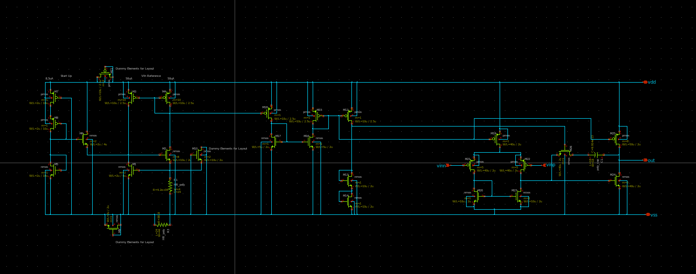
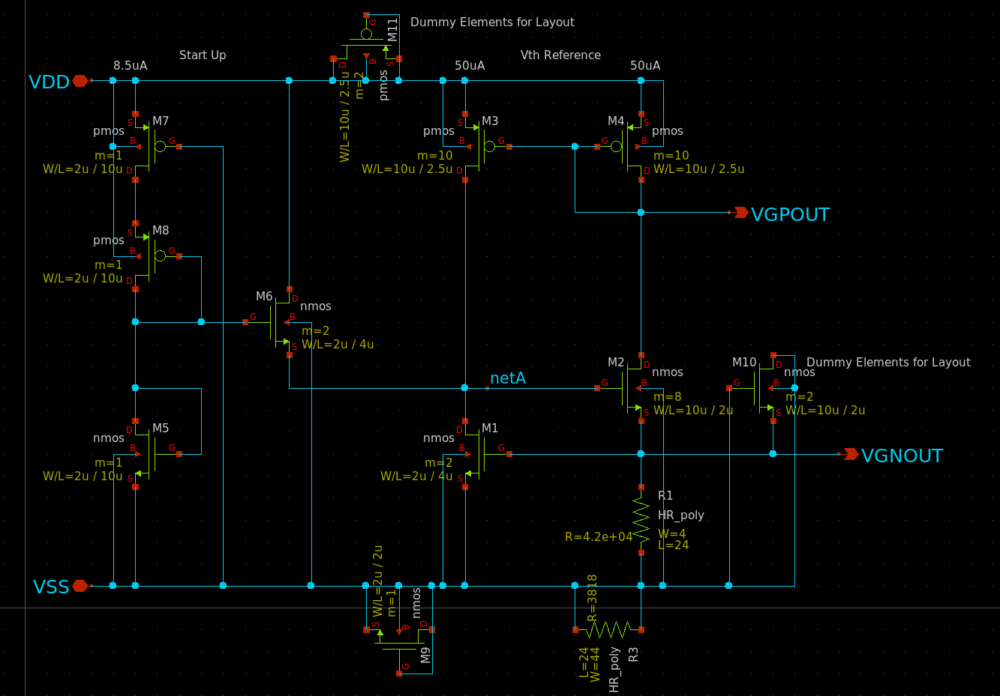
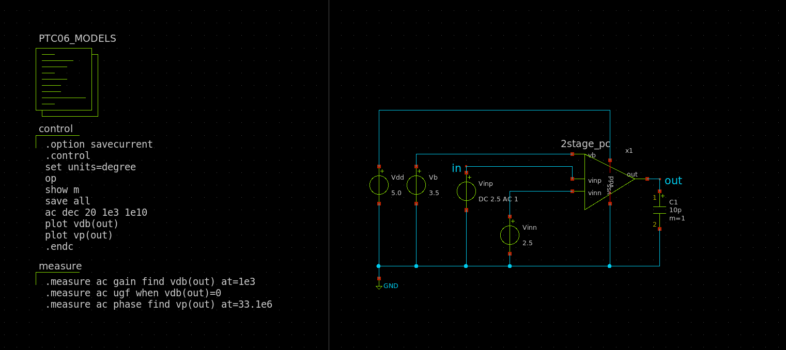
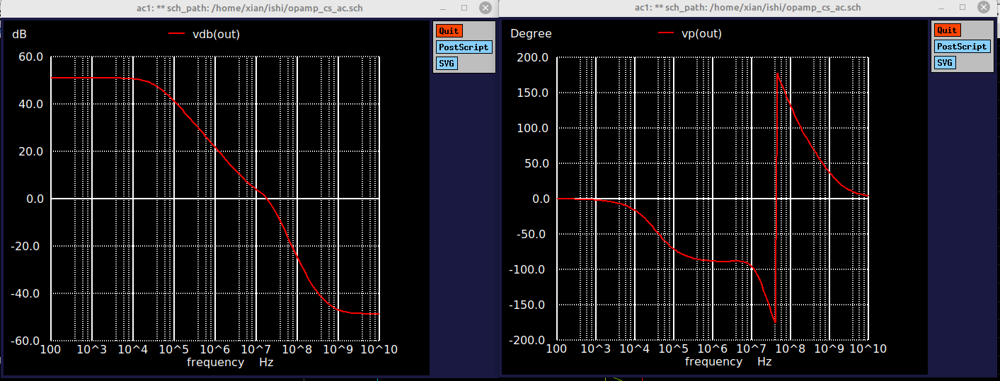
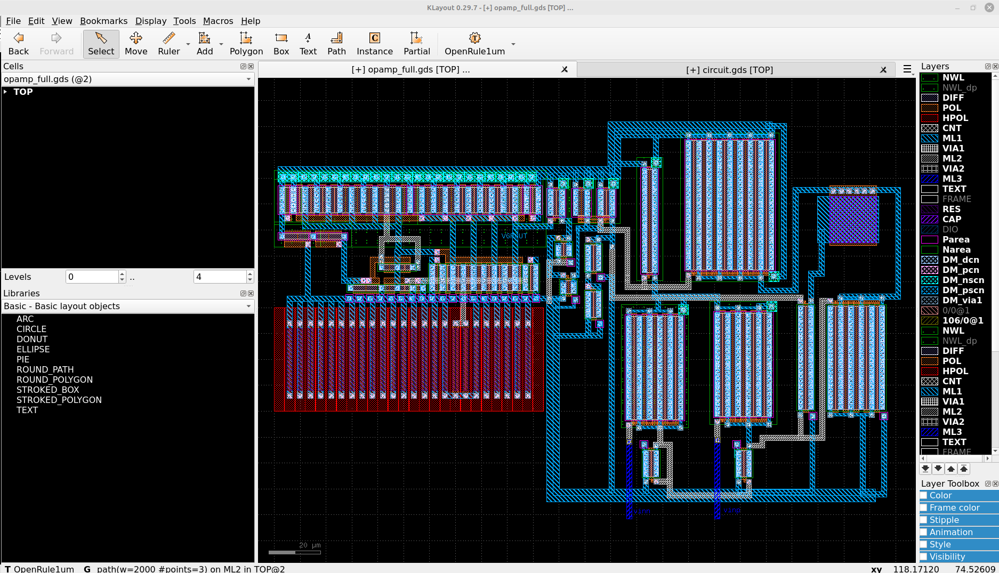

# 参加イベント
https://ishi-kai.org/openmpw/shuttle/ptc06/2025/06/14/shuttle_ISHI-Kai_OpenMPW-PTC06-2_OPAMP_Team.html
# 感想

前回Inverterを作ってみようの会に参加し、
次のステップとしてOPAMPのグループワークに参加させていただきました。
(https://github.com/ugeugeHigh/ISHI_xian_first)
KiCad等で回路設計して基板を作るところまではよくやりますが、
ICチップの中身を作れるというのはワクワクしますよね！  
このような機会を頂きありがとうございます！

大学・大学院ではグラフェンデバイスを作ったり、
液体ヘリウム温度下でデバイス物性の評価などをしていていましたが、  
思い返すとOPAMPについてしっかり勉強したことが無くて、中々理解するのがハードでした。
まだ理解が追いついていない部分が結構あります。

またレイアウトを作る部分はかなり苦戦しました。
チームの皆様に助けて頂きながら、なんとかgdsファイルをつくることができました。ありがとうございました！

低電流源回路部分はMaehashiさんの回路を使わせて頂きました。ありがとうございます。

# 回路全体
回路全体は下記のスクリーンショットのようになりました。
[opamp_cs_full.sch](opamp_cs_full.sch)

# 低電流源回路部分
電源部分はMaehashiさんに作って頂きました。ありがとうございます。
[VthRef.sch](VthRef.sch)
https://github.com/YuMaehashi/ISHI-KAI/tree/main/PTC06/202508_OPAMP

# テスト回路

[source_g.sch](source_g.sch)
[diffwl500-4.sch](diffwl500-4.sch)
[2stage_pc_3.sch](2stage_pc_3.sch)


10 KHzぐらいまでは50dB程度、20dBなら1MHzの帯域までカバーしている結果に。  
果たして結果はどうでしょうか？ワクワクですね！
# レイアウト
[opamp_full.gds](opamp_full.gds)

左側の電源部分はMaehashiさんに作って頂いき、右側のアンプ部分のレイアウトを描きました。
# エラー等つまづきポイント
LVSを実行するとRun timeエラーが発生。


対処方法は下記
1, PDKをアップデートする
2, lvs_workなどの自動生成されたファイルやディレクトリを全部消す
私の場合は１，２で解決しました。

ターミナルで アンインストールした後
```
bash uninstall.sh
```

最新版の環境構築用のスクリプトをダウンロードしてフェニテックシャトルPDK
https://github.com/ishi-kai/OpenRule1umPDK_setupEDA


